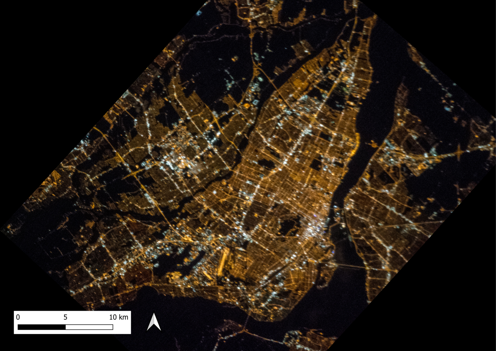

# ISS-processing
Image processing based on SAVESTARS SL preprocessed ISS images. Outputs of the software are the Melatonin Suppression Index (MSI), the Visual radiance, and the MSI impact defined as the product of the MSI with the visual radiance. The software can also produce inputs for the Illumina model.


This software is intend to be use you with the [Illumina model](https://github.com/aubema/illumina) that you can install from this [guide](https://lx02.cegepsherbrooke.qc.ca/~aubema/index.php/Prof/IlluminaGuide2021).





<h2> :clipboard: Execution Instruction</h2>

Follow the installation guide til steps 6 and make sure to execute the **illum inputs** command.
You will need to **modify the parameters** at the beginning of each execution script. It is recommended to put the different class spectrums in another directory.

</ul>
<p><b>1. Image_treatment.py</b></p
<p><b>2. Convert the georeferencing ISS images (raster) to XYZ files:</b></p>

``` 
gdal_translate -of XYZ PATH_RASTER.tiff PATH_XYZ.csv
```

<p><b>3. extract_from_tif.py</b>: Saving Numpy arrays containing data on the domain, intensity, and technology of the lamps.</p>
<p><b>4. make_discrete_inv.py</b>: Creating a discrete inventory of the light sources that can be used as input to the Illumina model.</p>


<h2> Contributors </h2>
This work was made by Martin Aubé, Julien-Pierre Houle, Nikki Veilleux, Justine Desmarais, Emie Bordeleau and Alexandre Simoneau.

